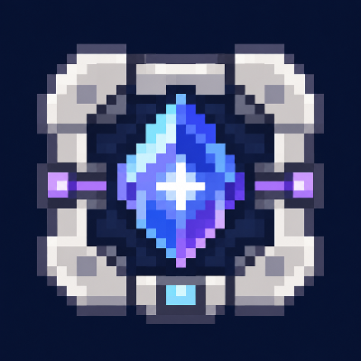

# Applied Astralsorcery

An addon for **Astral Sorcery** and **Applied Energistics 2 (AE2)** that lets ME networks store and transfer lumen and automate Astral Sorcery devices.

[CurseForge](https://www.curseforge.com/minecraft/mc-mods/appliedas) · [MIT License](LICENSE)

## Features

- **ME Celestial Gateway**: Travel to Celestial Gateways or inserted AE2 Spatial Storage Cells, with a return portal inside each cell.
- **ME Lumen Storage Cells**: Store lumen in ME networks. Available in 1k to 256k capacities, with artifact upgrades for 256k cells.
- **ME buses**: Use AE2's Import, Export and Storage Buses to transfer lumen and access external lumen storage.
- **ME Lumen Filament**: Transfer a selected lumen type from Astral Sorcery's lumen network into ME.
- **ME Lumen Array**: Generate lumen using Liquid Starlight and catalysts from ME, and exchange lumen with the network to maintain a set amount.
- **ME Lumen Alchemy Array**: Combine lumen using catalysts, Liquid Starlight and lumen supplied by ME.
- **ME Chalice**: Store up to 64,000 mB of fluid, restock from ME and optionally export surplus fluid.
- **ME Tree Beacon**: Keep the native tree-growth and harvesting behavior while returning harvested products to ME.
- **ME Starlight Infuser**: Automatically start valid infusion recipes and return products to ME, consuming Liquid Starlight from nearby Chalices, then ME, then world pools.
- **ME Lumen Crystallizer**: Mark a catalyst by right-clicking to automatically grow crystals using matching lumen and catalysts from ME. Sneak-right-click empty-handed to clear the mark; no GUI is needed.
- **ME Resonating Wand**: Build Astral Sorcery multiblocks using materials from ME and your inventory, and return replaced blocks to ME.
- **Aberrant Crystal**: Grow crystals in Liquid Starlight that can be merged or split and have Size, Purity and Cut attributes.
- **Aberrant Processor and Lumen Processor**: Craft processors from Aberrant Crystals and Lumen Crystals using the Inscriber.
- **Crystal Blocks and Extended AE**: Combine any 9 Aberrant Crystals or any 9 Lumen Crystals into their respective blocks. Extended AE's Circuit Slicer turns each block into 9 circuit boards, and its Crystal Assembler crafts processors in batches of 4.
- **Constellation Core**: Crafted on an Iridescent Crafting Altar from crystals attuned to all 12 constellations.
- **Iridescent Attunement Altar**: Attune items in 12 independent Constellation Relays arranged three per side, with each side's midpoint six blocks from the center. Visible constellations illuminate their 3×3 sooty-marble star maps; Prismatic lumen bypasses the sky conditions. Finished items launch upward for collection. Supports the original Resonating Wand's structure projection and creative auto-build, plus material-based construction with the ME wand.
- **Altar Automation Interface**: Automate altar crafting through an ME Pattern Provider, supplying items, fluids and lumen and returning products to the provider.
- **Automatic Starmetal Chisel**: Automatically process crystals, Starmetal Ingots and artifacts using Evorsio lumen.
- **Starlight Transmutation Chamber**: Automate starlight item transmutation using a linked Collector Crystal or Lens, and send products to ME.
- **Non-Empty Annihilation Plane**: Collect blocks only if they drop items, while retaining AE2's fluid and dropped-item collection.

## Requirements

Minecraft **1.21.1**, NeoForge **21.1.238 or later**, and **Java 21**, with compatible versions of these mods:

| Required mod | Version |
| --- | --- |
| [Astral Sorcery](https://www.curseforge.com/minecraft/mc-mods/astral-sorcery) | 2.0.0 or later |
| [Applied Energistics 2](https://www.curseforge.com/minecraft/mc-mods/applied-energistics-2) | 19.2.17 or later, below 20 |
| [GuideME](https://www.curseforge.com/minecraft/mc-mods/guideme) | 21.1.1 or later |
| [ObserverLib](https://www.curseforge.com/minecraft/mc-mods/observerlib) | 1.10.3 or later |
| [Curios API](https://www.curseforge.com/minecraft/mc-mods/curios) | 9.5.1 or later |

JEI, Jade and AE2 JEI Integration are optional.

Jade shows AE2's native network status for the Starlight Transmutation Chamber, ME Lumen Array and ME Chalice, including online, offline, network booting and missing channels.

## Development checks

Run `./gradlew build` for the release jar. Run `./gradlew runAttunementGameTest -PattunementGameTests` for the attunement and ME automation integration tests in an isolated world under `build/attunement-gametest`. Test classes and structures are excluded from release jars.
